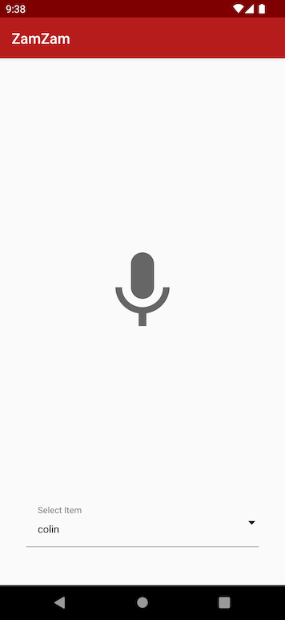
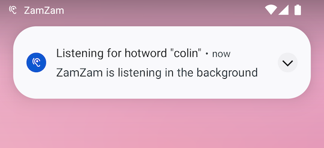
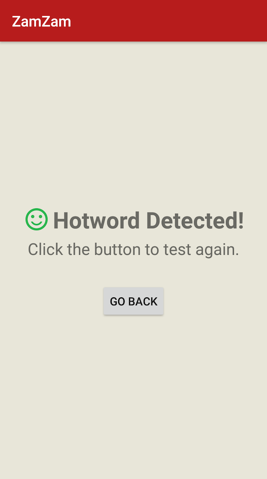

# ZamZam

An POC app demonstrating on-device wake word voice recognition using the PocketSphinx engine

The app lets you select a wake word, and then - even with the app in the background or the phone in your pocket - it notifies you noisily and with vibration when that word is head.

The sensitivity of the voice reco engine is tunable to balance between false positives and not heading the word.

The idea of this app is that it could be useful for someone that is hearing impaired to help them when someone says their names.  The app does not use or require any kind of network connection for the voice recognition.

## Technologies Used:

- [PocketSphinx](http://www.speech.cs.cmu.edu/pocketsphinx/)
- [Databinding](https://developer.android.com/topic/libraries/data-binding)
- [View Binding](https://developer.android.com/topic/libraries/view-binding)
- [Smart Material Spinner](https://developer.android.com/guide/components/loaders)
- [Foreground Services](https://developer.android.com/guide/components/foreground-services)
- [Notifications](https://developer.android.com/guide/topics/ui/notifiers/notifications)

## Screenshots

### Main Page

### Foreground Services

### Upon Heading Wake Word

