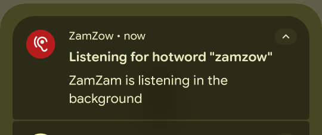
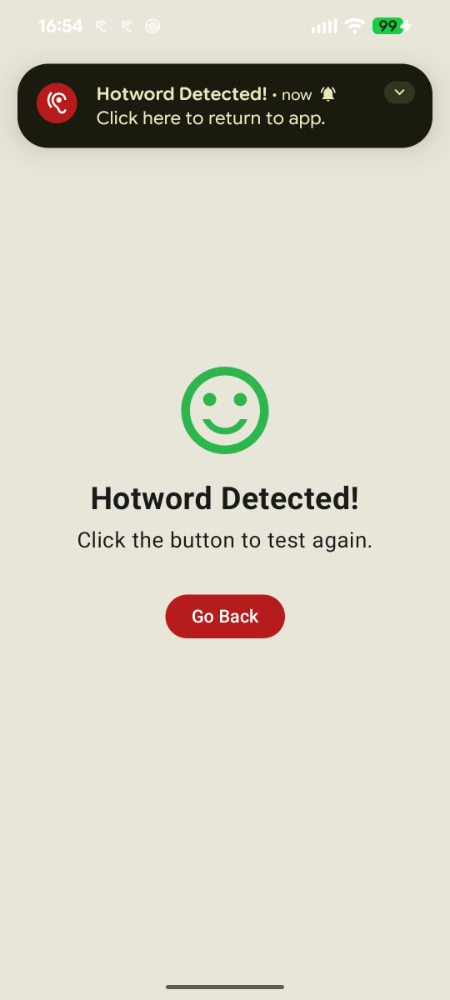

# ZamZow

ZamZow is an Android proof-of-concept that uses PocketSphinx for offline wake word detection. The app runs a foreground audio service and listens for a configurable word or name, with the original accessibility idea being to help someone who is hearing impaired notice when they are being addressed. I recently revisited the project to modernize the architecture, clean up the implementation, and bring the UI closer to a modern Android development style.

---

## Features

### Wake Word Selection
Choose any word from the PocketSphinx built-in dictionary using the searchable dropdown on the main screen. Start typing to filter the list. The app defaults to the word "zamzow" but anything in the dictionary works.

The microphone icon reflects the current listening state:

| Icon | Meaning |
|---|---|
| 🔇 Light grey | Idle / waiting to start |
| 🎙️ Grey | Actively listening |
| 🎙️ Green | Speech detected |
| 🔴 Red mic-off | Microphone permission not granted |

---

### Background Listening
Once a wake word is selected and microphone permission is granted, ZamZow keeps listening even after you lock your phone or switch to another app. A persistent foreground-service notification confirms it is running and shows which word it is listening for.

---

### Wake Word Detected Alert
When the wake word is heard, ZamZow:
- Plays a loud alarm-style chime
- Vibrates the device
- Posts a heads-up notification (even when the screen is off)
- Brings the detected screen to the foreground if the app is open

Tap **Go Back** to dismiss and resume listening.

---

### Sensitivity
Open **Settings** (gear icon, top-right of the main screen) to adjust the detection threshold.

A **higher** value triggers more easily — useful in quiet environments or if the word is being missed. A **lower** value requires clearer pronunciation — useful to reduce false positives in noisy surroundings. The default works well in most conditions.

---

## Permissions

| Permission | Why it's needed |
|---|---|
| `RECORD_AUDIO` | Wake word detection via the microphone |
| `POST_NOTIFICATIONS` | Heads-up alert when the wake word is heard |
| `FOREGROUND_SERVICE_MICROPHONE` | Keep the listener running in the background |

All permissions are explained at first launch before the system dialog appears. The microphone is used entirely on-device — audio is never transmitted anywhere.

---

## Tech Stack

- **Language:** Kotlin
- **UI:** Jetpack Compose + Material 3
- **Architecture:** MVVM with `ViewModel` + `StateFlow`
- **DI:** Hilt
- **Persistence:** DataStore (wake word preference, onboarding state)
- **Background:** Foreground `Service` with microphone foreground-service type
- **Voice recognition:** [PocketSphinx](https://cmusphinx.github.io/) — fully on-device, no internet required
