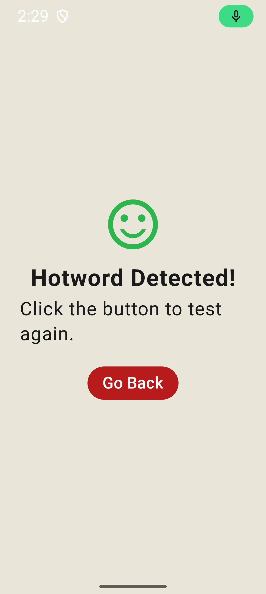
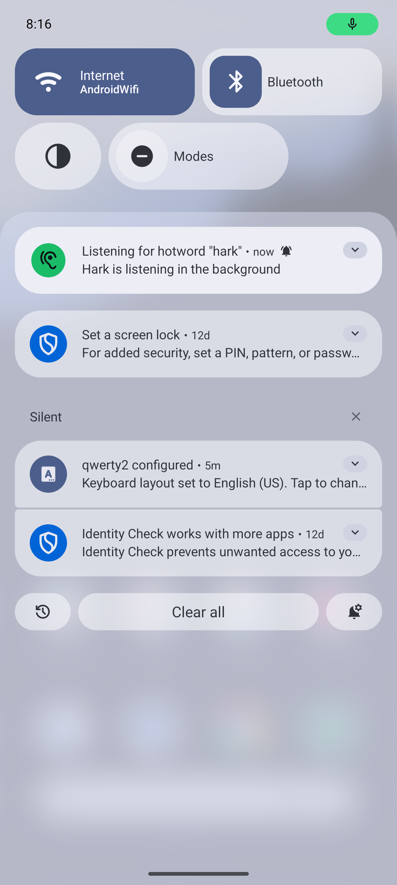

# Hark

Offline wake-word detection on Android — no network call ever leaves the device. Say a configured word and Hark fires a heads-up notification immediately, even with the screen off. [PocketSphinx](https://cmusphinx.github.io/) runs the CMU acoustic model entirely in-process, so detection works in airplane mode or anywhere else connectivity is unavailable.

The original use case was accessibility: alerting a hearing-impaired user the moment someone nearby says their name. I revisited the project to modernise the architecture, sharpen the implementation, and bring the code up to a standard I'd be comfortable shipping.

---

## How the on-device recognition works

PocketSphinx bundles a pre-trained acoustic model (CMU US English, PTM variant) and a pronunciation dictionary of ~130k words. At runtime, Hark:

1. Syncs the bundled model assets to the app's files directory on first launch.
2. Configures a `SpeechRecognizer` with a keyphrase search and a sensitivity threshold (`1e-2×sensitivity`).
3. Starts continuous listening on the recogniser. Partial results stream in on every audio frame; when a partial result contains the target word, detection fires immediately without waiting for an utterance boundary.
4. On detection, the recogniser stops, clears its hypothesis buffer, and restarts — ready for the next trigger.

No audio ever leaves the device. The microphone feed is consumed entirely by PocketSphinx running in-process.

---

## Architecture

- **MVVM** — `ListenerViewModel` owns all recogniser state and exposes it as a single `StateFlow<ListenerUiState>`. The Activity and Compose screens observe this flow; they never touch the recogniser directly.
- **Foreground service** — Android 14+ requires microphone foreground services to be started while the app is in the foreground. `ListenerService` is started from `onResume` to satisfy this constraint, then keeps running in the background.
- **Hilt** — `SpeechRecognizer`, `ChimePlayer`, and `DictionaryRepository` are injected; `PreferencesManager` wraps a `DataStore<Preferences>` injected through `AppModule`.
- **DataStore** — wake word choice and onboarding state survive process death.
- **Permission recovery** — if the user sets microphone permission to "Ask Every Time" and force-closes the app, `onResume` re-requests the permission once per Activity session using `ActivityResultContracts.RequestMultiplePermissions`, with a flag to prevent a loop when the dialog dismissal triggers another `onResume`.

---

## Tech Stack

| | |
|---|---|
| **Language** | Kotlin |
| **UI** | Jetpack Compose + Material 3 |
| **Architecture** | MVVM, `ViewModel` + `StateFlow` |
| **DI** | Hilt |
| **Persistence** | DataStore |
| **Background** | Foreground `Service`, microphone type |
| **Voice recognition** | PocketSphinx (on-device, no internet) |
| **CI** | GitHub Actions — lint, unit tests, debug APK |

---

## Testing

64 unit tests across five classes, all running on the JVM without Robolectric:

- **`ListenerViewModelTest`** (35) — initial state, permission transitions, all `RecognitionListener` callbacks (begin/end/partial/result), re-trigger guard, sensitivity changes, wake-word flow updates, `onCleared`
- **`PreferencesManagerTest`** (10) — real `DataStore` backed by a temp file; covers read, write, overwrite, and clear for both preferences
- **`ListenerUiStateTest`** (11) — data class semantics and copy behaviour
- **`NotificationUtilsTest`** (6) — vibration pattern, notification IDs
- **`MicStateTest`** (2) — enum completeness

Key testing choices:

- `ContextCompat.checkSelfPermission` routes through `context.checkPermission(permission, pid, uid)` on the JVM (SDK\_INT = 0 path). Stubbing `checkPermission` on the mock `Application` gives full permission control without `mockkStatic`.
- `returnDefaultValues = true` makes Android stub methods return 0/null instead of throwing, so coroutines in the `ViewModel` init block run to completion.
- `recognitionListener` is `internal` so tests call its callbacks directly and assert on the resulting `uiState`.

---

## Permissions

| Permission | Why |
|---|---|
| `RECORD_AUDIO` | Microphone input for wake-word detection |
| `POST_NOTIFICATIONS` | Heads-up alert when the word is heard |
| `FOREGROUND_SERVICE_MICROPHONE` | Keep the listener alive in the background |

---

## Screenshots

<table>
<tr>
<td></td>
<td></td>
<td></td>
</tr>
<tr>
<td align="center">Main screen</td>
<td align="center">Wake word detected</td>
<td align="center">Background notification</td>
</tr>
</table>
